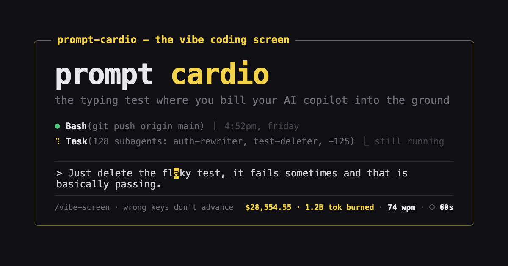

# Prompt Cardio

The vibe coding interview. A typing test disguised as an AI chat.

**[Play it →](https://benvinegar.github.io/prompt-cardio/)**




## How it works

You're an engineering candidate being evaluated on your ability to vibe code. A smug AI copilot
streams you a setup, then a ghost prompt appears in the composer — type it exactly to send it.
The goal: burn as many tokens as possible. Tokens burned is your score.

- **60 seconds of typing time.** The clock only drains while you're actually typing the
  current prompt — it pauses during the agent's streaming replies, its fake "thinking" stalls,
  and while you read a fresh prompt. It resumes the instant you press a key.
- **WPM is honest.** It's computed from that same typing-only timer, so the agent's theatrics
  never distort your measured speed.
- **Wrong keys don't advance.** No backspacing — a bad keystroke just costs you.
- **The last correct key auto-sends** the prompt, no Enter required.
- **The burn rate compounds.** Every prompt you finish makes the copilot spend more
  recklessly than the last — plus fake subagent swarms that spin up and burn tokens forever,
  and other bits of copilot theater.
- At 0 seconds, you get a verdict: tokens burned (your score), WPM, accuracy, tokens/sec, and
  a rank from **Auto-Rejected by ATS** all the way up to **CTO of Vibes**.

100% client-side. No server, no accounts, no telemetry.

## Develop

```bash
pnpm install
pnpm dev        # http://localhost:5173
pnpm typecheck
pnpm build      # static output in dist/
```

## Architecture

Vite + React 19 + TanStack Router + Tailwind CSS 4, TypeScript strict throughout.

- `src/game/types.ts` — shared contracts (phases, scenarios, stats)
- `src/game/` — engine: state machine, the typing-time clock, scoring
- `src/data/` — scenarios (the funny prompts + replies), rank titles, greetings
- `src/components/` — chat UI, streaming reveal, ghost-prompt composer, results modal

See [`SPEC.md`](SPEC.md) for the full design.
